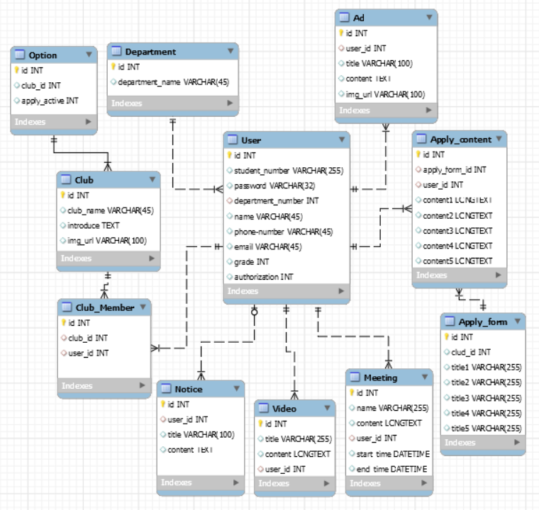
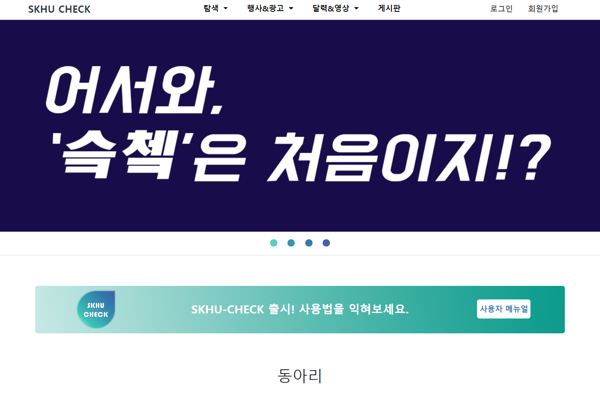

# SKHU 단체(소모임 & 동아리) 활성 웹 서비스
+ [SkhuCheck이전 AriCheck작품 제안서](./document/LIKELION_Ari_Check_작품_설명서최종.pdf)

## DB구조

## 실행화면

## Back-End (기능 단위)
* 로그인, 회원가입, 로그아웃, 회원정보수정 기능 
* 이중댓글
* 단체별 달력 일정 관리
* 단체별 동영상 등록
* 현재 지원 가능 단체 모아보기 R )
* 각 단체의 Notice 게시판의 CRUD
* 통합 Ad 게시판의 CRUD
* 각 단체의 회원 명단 RD(Club Admin) 
* 각 단체의 소개 U (Club Admin) 
* 각 단체의 지원 양식 U (Club Admin) 
* 각 단체의 지원자 조회 R (Club Admin)  
* 각 단체의 Options Table U (Club Admin) 
* 전체 회원 목록 R (Super Admin) 
* 단체 CD (Super Admin)  

## Author
* 김승래
* 함진경
* 한현수
* 박결
* 홍다은

